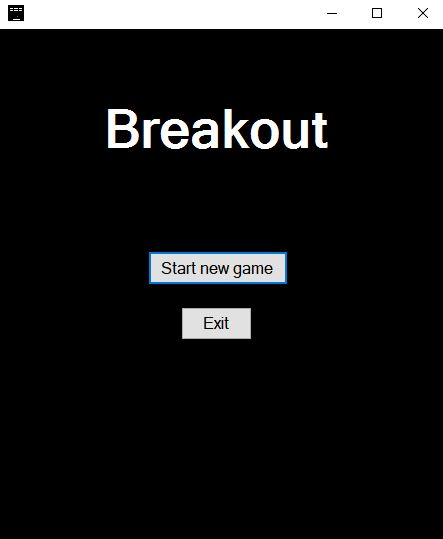
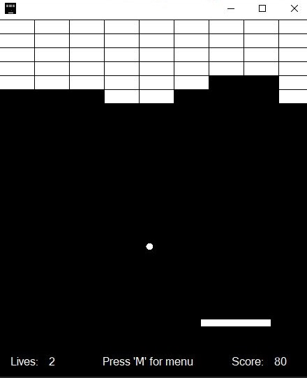
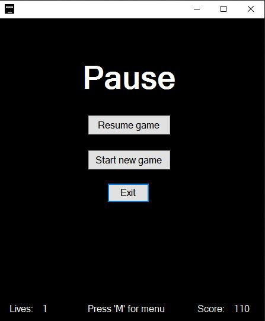
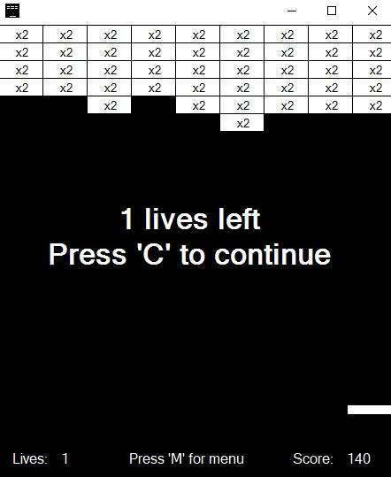
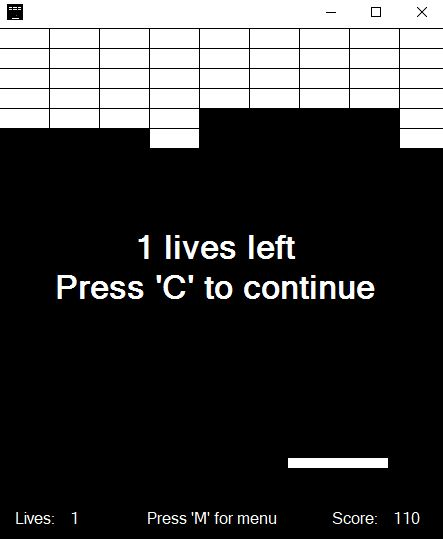
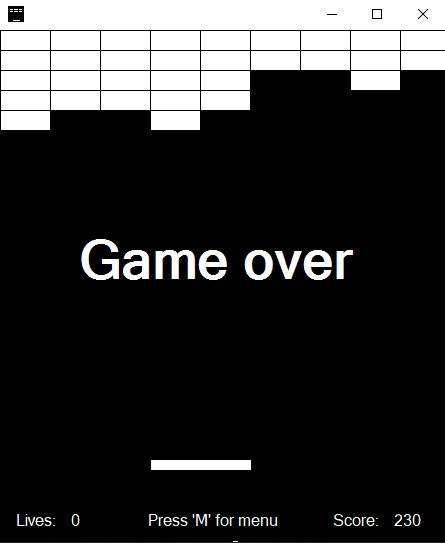
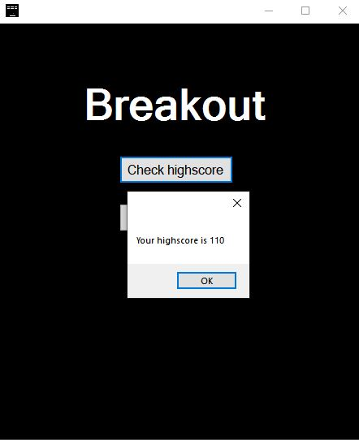

# Breakout
A version of the arcade game Breakout that was developed in Visual Studio using C# Window Form App (.NET Framework). This was developed as one of two main projects for the Otago Polytechnic Bachelor of Information Technology Programming 2 paper (IN511001). 

## Installation
The project source code can be launch using Visual Studio 2017 where you can use the built-in debugger to launch the game. To Launch the game without using Visual Studio, open the .exe file located in the home directory of this repo (Breakout.exe).

## Technologies Used  
C#  
Window Form App (.NET Framework)  
Visual Studio 2017  

## Gameplay
This game plays like any other version of breakout where the player’s aim is to break every single block on the screen. This is done by bouncing a ball around the screen and keeping the ball from escaping at the bottom of the screen by using a player-controlled paddle. User can control their paddle using their mouse. If the ball falls off the bottom of the screen, then the player will lose one life out of three total lives. When all lives all lost, the game is over. Your score, if higher than your previous attempts, will be added to the high scoreboard. The score is obtained by breaking the brick which will give you 10 points for a standard brick. If the player can break the bricks consecutively without losing a life, a multiplier will be applied to the bricks which will be indicated on the bricks. The maximum multiplier a player can earn is x3.   

### Home Screen

### Gameplay

### Pause Screen

### Brick Multiplier

### Death Screen

### Game Over

### Highscore

